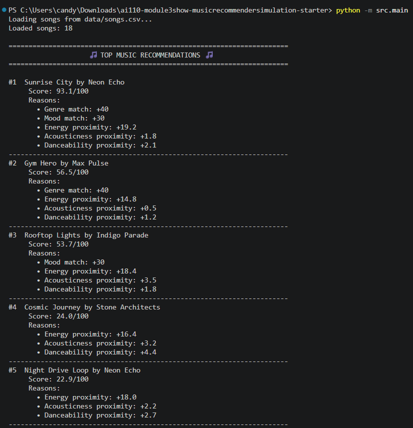
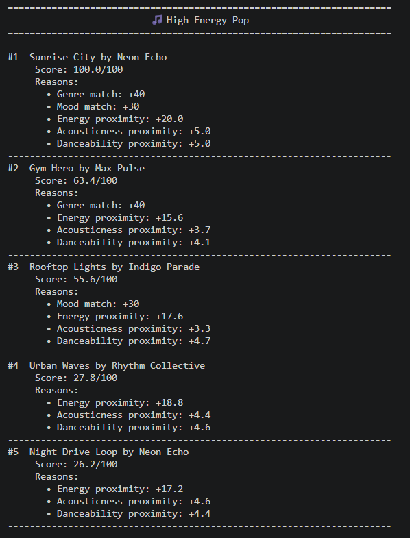
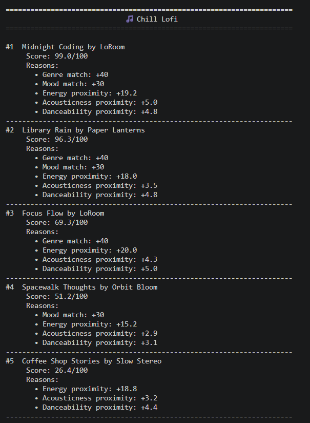
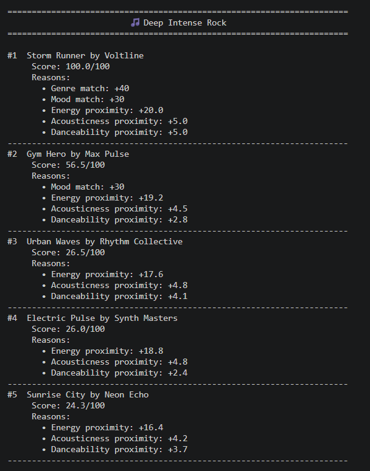
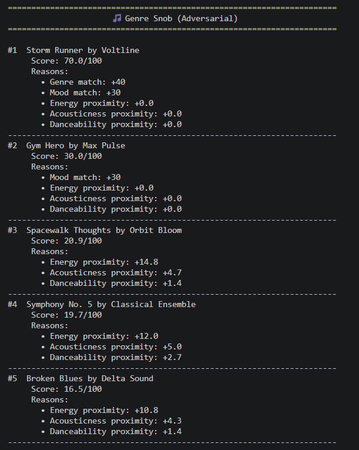
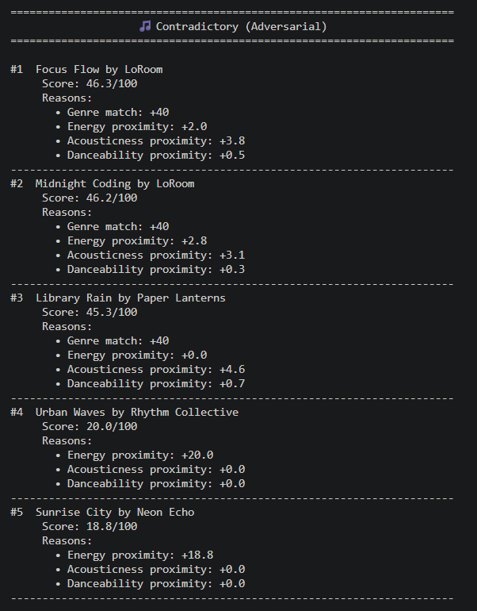
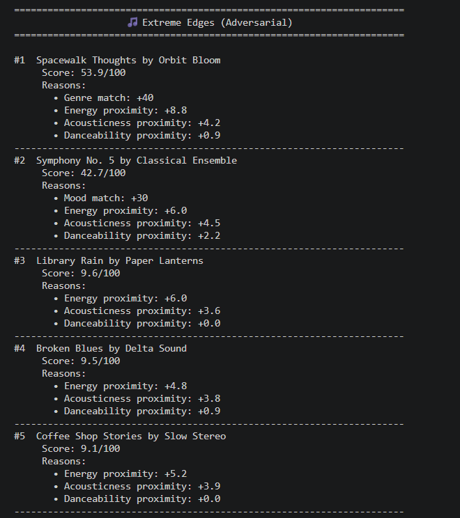

# 🎵 Music Recommender Simulation

## Project Summary

This project builds a simple content-based music recommender system in Python. It loads a catalog of 18 songs from a CSV file, compares each song against a user taste profile using a weighted scoring formula, and returns the top 5 recommendations ranked by score. Each recommendation includes an explanation of exactly why it scored the way it did.

---

## How The System Works

- What features does each `Song` use in your system?
  - genre, mood, energy, acousticness, and danceability

- What information does your `UserProfile` store?
  - favorite_genre, favorite_mood, target_energy, target_acousticness, and target_danceability

- How does your `Recommender` compute a score for each song?
  - Genre match adds 40 points and mood match adds 30 points, both all or nothing. Energy, acousticness, and danceability each contribute up to 20, 5, and 5 points respectively using a proximity formula that rewards songs closer to the user's target values.

- How do you choose which songs to recommend?
  - All 18 songs are scored, sorted from highest to lowest, and the top 5 are returned. A diversity penalty also prevents the same artist from appearing more than once.

## Getting Started

### Setup

1. Create a virtual environment (optional but recommended):

   ```bash
   python -m venv .venv
   source .venv/bin/activate      # Mac or Linux
   .venv\Scripts\activate         # Windows

2. Install dependencies

```bash
pip install -r requirements.txt
```

3. Run the app:

```bash
python -m src.main
```

### Running Tests

Run the starter tests with:

```bash
pytest
```

You can add more tests in `tests/test_recommender.py`.

---

## Experiments You Tried

* CLI Verification (default pop/happy profile)
Sunrise City scored 93.1/100 as the top pick since it matched both genre (pop) and mood (happy) exactly, plus had very similar energy to the target. Gym Hero ranked #2 with 56.5 because it matched genre but not mood. Rooftop Lights ranked #3 matching mood but not genre. Songs with no categorical matches scored very low (under 25).



* Stress Test with Diverse Profiles

**High-Energy Pop**


**Chill Lofi**


**Deep Intense Rock**


**Genre Snob (Adversarial)**


**Contradictory (Adversarial)**


**Extreme Edges (Adversarial)**


* Feature Removal Experiment (Mood Check Commented Out)
Removing the mood check dropped all scores by up to 30 points. Rooftop Lights dropped from #3 to #5 in the High-Energy Pop profile because it was relying entirely on mood match with no genre match. Focus Flow jumped to #1 in Chill Lofi because without mood as a tiebreaker, pure energy proximity took over. This shows mood is doing real work in the ranking, not just adding noise.

---

## Limitations and Risks

- It only works on a catalog of 18 songs, so users with niche tastes like blues or reggae get very few real matches
- It does not understand lyrics, language, or cultural context
- It over-favors genre matching since 40 out of 100 points come from genre alone, meaning songs from the wrong genre almost never appear even if they sound similar
- It treats every user as having one fixed taste profile and cannot handle context like working out vs studying

## Reflection

- What did you learn about how recommenders turn data into predictions?
  Building this showed me that recommendations are just math. Every song gets a number and the highest number wins. The "intelligence" comes entirely from how you design the weights, not from the system understanding music in any real sense.

- Where could bias or unfairness show up in systems like this?
  The biggest risk is that underrepresented genres like blues or reggae only have one song in the dataset, so users who prefer those genres always get weak recommendations. The system also creates filter bubbles by heavily rewarding exact genre and mood matches, meaning users rarely get exposed to anything outside what they already said they like.